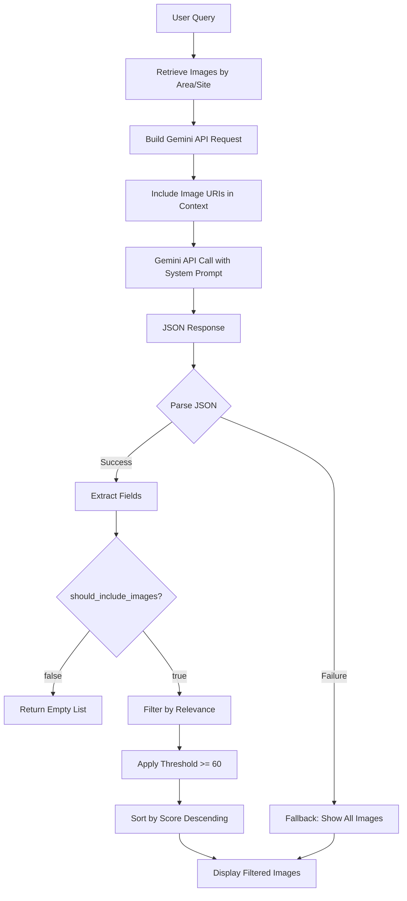
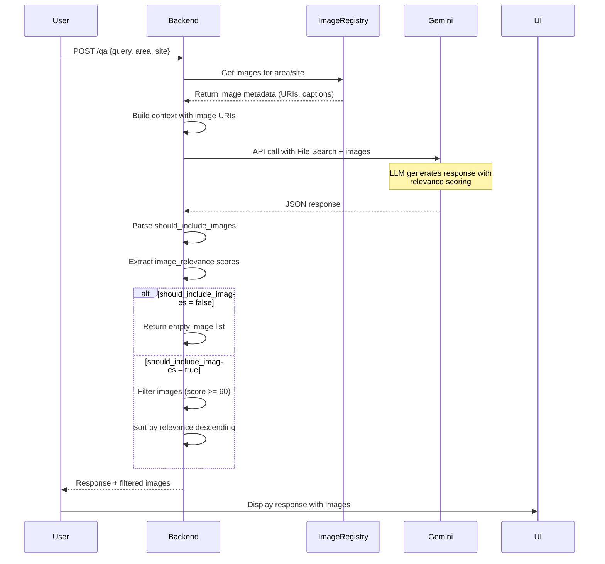
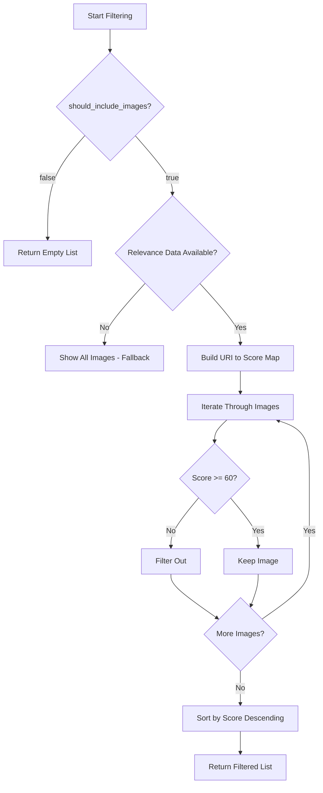
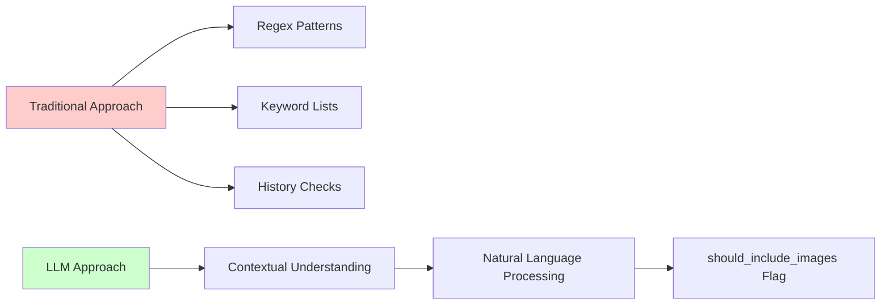
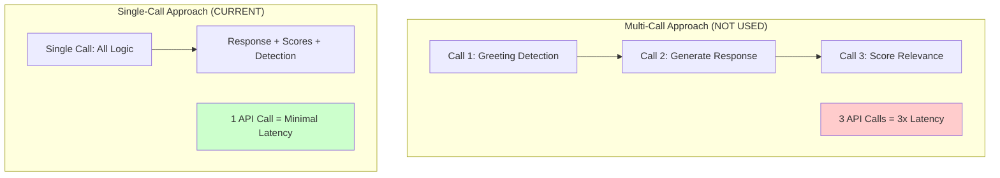

# Image Filtering System

## Overview

The image filtering system uses **LLM-based relevance scoring** to intelligently decide which images to display to users. The system handles both greeting detection (whether to show images at all) and relevance filtering (which specific images to show).

## Key Features

- **Single API Call**: All logic (response generation, greeting detection, relevance scoring) in one Gemini API call
- **LLM-Driven Decisions**: No hardcoded rules - the model understands context naturally
- **Threshold-Based Filtering**: Only images with relevance score ≥ 60 are displayed
- **Natural Commentary**: LLM adds engaging descriptions when showing images
- **Backward Compatible**: Falls back to showing all images if no relevance data available

## Architecture



## Response Flow



## JSON Response Schema

The LLM returns a JSON object with three key fields:

```json
{
  "response_text": "תשובה מפורטת בעברית...",
  "should_include_images": true,
  "image_relevance": [
    {
      "image_uri": "gs://bucket/path/to/image_001.jpg",
      "relevance_score": 95
    },
    {
      "image_uri": "gs://bucket/path/to/image_002.jpg",
      "relevance_score": 85
    },
    {
      "image_uri": "gs://bucket/path/to/image_003.jpg",
      "relevance_score": 40
    }
  ]
}
```

### Field Descriptions

| Field | Type | Purpose |
|-------|------|---------|
| `response_text` | string | Main response to user query (Hebrew or query language) |
| `should_include_images` | boolean | Whether to show images (false for greetings/abstract questions) |
| `image_relevance` | array | List of image URIs with relevance scores (0-100) |

## Filtering Logic

### Decision Tree



### Threshold Criteria

**Current Threshold: 60/100**

| Score Range | Decision | Example |
|-------------|----------|---------|
| 80-100 | ✅ High relevance | Direct match to query topic |
| 60-79 | ✅ Medium relevance | Related to query context |
| 40-59 | ❌ Low relevance | Tangentially related |
| 0-39 | ❌ Not relevant | Unrelated to query |

## Implementation Details

### Code Location

| Component | File | Lines |
|-----------|------|-------|
| Main filtering logic | [backend/endpoints/qa.py](../backend/endpoints/qa.py) | 109-174 |
| JSON parsing | [backend/endpoints/qa.py](../backend/endpoints/qa.py) | 294-308 |
| System prompt | [config/prompts/tourism_qa.yaml](../config/prompts/tourism_qa.yaml) | - |

### Function Signature

```python
def filter_images_by_relevance(
    images: List[Dict],
    relevance_data: List[Dict],
    threshold: int = 60
) -> List[Dict]:
    """
    Filter images based on LLM relevance scores.

    Args:
        images: List of image objects with metadata (uri, caption, context)
        relevance_data: List of {image_uri, relevance_score} from LLM
        threshold: Minimum score to include (default: 60)

    Returns:
        Filtered list sorted by relevance (descending)
    """
```

### Filtering Algorithm

```python
# Step 1: Build URI to score mapping
uri_to_score = {
    item["image_uri"]: item["relevance_score"]
    for item in relevance_data
}

# Step 2: Filter and enrich images
filtered = []
for img in images:
    score = uri_to_score.get(img["uri"])
    if score is not None and score >= threshold:
        img_copy = img.copy()
        img_copy["relevance_score"] = score
        filtered.append(img_copy)

# Step 3: Sort by relevance (descending)
filtered.sort(key=lambda x: x["relevance_score"], reverse=True)

return filtered
```

## Use Cases

### Case 1: Substantive Query

**Query:** "תספר לי על השקנאים באגמון חפר"

**LLM Response:**
```json
{
  "response_text": "השקנאים הלבנים באגמון חפר הם אחד המראות המרהיבים...",
  "should_include_images": true,
  "image_relevance": [
    {"image_uri": "gs://.../heron_colony.jpg", "relevance_score": 95},
    {"image_uri": "gs://.../wetland_birds.jpg", "relevance_score": 85},
    {"image_uri": "gs://.../visitor_center.jpg", "relevance_score": 40},
    {"image_uri": "gs://.../sunrise_view.jpg", "relevance_score": 70}
  ]
}
```

**Filtering Result:**
- ✅ heron_colony.jpg (95) - shown first
- ✅ wetland_birds.jpg (85) - shown second
- ✅ sunrise_view.jpg (70) - shown third
- ❌ visitor_center.jpg (40) - filtered out

**Images Displayed:** 3 images, sorted by relevance

### Case 2: Greeting

**Query:** "שלום, מה שלומך?"

**LLM Response:**
```json
{
  "response_text": "שלום! שמח לראות אותך. אני כאן כדי לעזור לך...",
  "should_include_images": false,
  "image_relevance": []
}
```

**Filtering Result:**
- No images displayed (greeting detection)

### Case 3: Abstract Question

**Query:** "מה אפשר לעשות בסוף השבוע?"

**LLM Response:**
```json
{
  "response_text": "יש המון אפשרויות לסוף שבוע באזור...",
  "should_include_images": false,
  "image_relevance": []
}
```

**Filtering Result:**
- No images displayed (too abstract, no specific content focus)

## Greeting Detection

### How It Works

The LLM determines whether a query is a greeting or abstract question by analyzing:

1. **Query Intent**: Is this asking for specific information or just saying hello?
2. **Conversation Context**: Is this an initial greeting or follow-up?
3. **Specificity**: Does the query reference concrete topics or general concepts?

### No Hardcoded Rules



**Benefits:**
- ✅ Handles variations naturally (Hebrew/English greetings)
- ✅ Understands context beyond keywords
- ✅ No maintenance of pattern lists
- ✅ Works across languages

## System Prompt Instructions

The system prompt instructs the LLM to:

1. **Return JSON format** with specific fields
2. **Detect greetings** and set `should_include_images=false`
3. **Score relevance** for each image (0-100 scale)
4. **Add commentary** when showing images naturally in Hebrew

Example instruction excerpt:
```yaml
system_prompt: |
  ...
  Return your response as JSON with:
  - response_text: Your main response in Hebrew
  - should_include_images: false for greetings, true for substantive queries
  - image_relevance: Array of {image_uri, relevance_score} for each image

  When showing images, add natural commentary like:
  "שימו לב כמה יפים השקנאים האלה!"
  ...
```

## Performance Considerations

### Single API Call Strategy

**Why one call instead of multiple?**



**Benefits:**
- Lower latency (1 round-trip vs 3)
- Lower cost (1 API call vs 3)
- Consistent context across all decisions
- Simpler error handling

### Caching Considerations

- **Image Registry**: Cached in memory during session
- **Relevance Scores**: Not cached (query-specific)
- **Filtered Results**: Not cached (query-specific)

## Logging & Debugging

### Log Levels

```python
# Debug level - detailed filtering steps
logger.debug(f"should_include_images: {should_include_images}")
logger.debug(f"image_relevance_data: {image_relevance_data}")
logger.debug(f"Filtering {len(images)} images with threshold {threshold}")
logger.debug(f"Filtered to {len(filtered_images)} images")

# Info level - results
logger.info(f"Image filtering complete: {len(filtered_images)} images selected")

# Warning level - issues
logger.warning(f"No relevance data for image {img['uri']}, falling back to show all")
```

### Debugging Checklist

When images aren't showing as expected:

1. ✅ Check `should_include_images` flag in logs
2. ✅ Verify relevance scores in response JSON
3. ✅ Confirm threshold setting (default: 60)
4. ✅ Check JSON parsing success/failure
5. ✅ Verify image URIs match registry
6. ✅ Review system prompt instructions

## Known Issues & Workarounds

### Issue #40: Structured Output Compatibility

**Problem:** Gemini 2.5 doesn't support File Search tool + `response_schema` simultaneously

**Solution:** Manual JSON parsing from text response
- System prompt instructs JSON format
- Parse JSON from `response_text` field
- Fallback gracefully if parsing fails

### Issue #18: Initial Implementation

**Original Approach:** Hardcoded greeting detection
**Current Approach:** LLM-based contextual understanding
**Migration:** Seamless (backward compatible fallback)

## Configuration

### Adjustable Parameters

| Parameter | Location | Default | Notes |
|-----------|----------|---------|-------|
| Relevance threshold | `qa.py:109` | 60 | Can be tuned 0-100 |
| Max images per query | `qa.py` | 5 | Included in API context |
| JSON parsing timeout | N/A | None | Fails gracefully |

### Location-Specific Overrides

Image filtering works with location-specific config:
- Custom system prompts can adjust commentary style
- Temperature affects scoring consistency
- Model selection impacts relevance quality

Example override:
```yaml
# config/locations/hefer_valley/agamon_hefer/prompts/tourism_qa.yaml
system_prompt: |
  אתה דני, מדריך צפרות מומחה...
  כשאתה מראה תמונות, תן דגש מיוחד לציפורים!
```

## Testing

### Unit Tests

Location: [backend/tests/test_qa_endpoint.py](../backend/tests/test_qa_endpoint.py)

```python
def test_image_filtering_with_relevance():
    """Test that images are filtered by relevance score >= 60"""
    # Setup mock images and relevance data
    # Verify filtering logic
    # Assert correct images returned

def test_greeting_detection():
    """Test that greetings suppress images"""
    # Test should_include_images = false
    # Verify empty image list returned
```

### Integration Tests

```bash
# Test against deployed backend
pytest tests/test_qa_api_integration.py -v -k image_filtering
```

## Future Enhancements

### Potential Improvements

1. **Adaptive Threshold**: Learn optimal threshold per location
2. **User Preferences**: Allow users to control image quantity
3. **A/B Testing**: Compare threshold values (50 vs 60 vs 70)
4. **Performance Metrics**: Track relevance score accuracy
5. **Image Diversity**: Ensure variety in filtered results

### Not Planned (By Design)

- ❌ Separate API call for relevance (increases latency)
- ❌ Client-side filtering (server knows context better)
- ❌ Rule-based greeting detection (LLM is more flexible)

## References

### Related Documentation

- [Backend API Documentation](../backend/README.md)
- [Multimodal Image Support](../CLAUDE.md#multimodal-image-support)
- [Configuration Overrides](../CLAUDE.md#location-specific-configuration-overrides)

### Key Files

- [backend/endpoints/qa.py](../backend/endpoints/qa.py) - Main filtering logic
- [config/prompts/tourism_qa.yaml](../config/prompts/tourism_qa.yaml) - System prompt
- [backend/models.py](../backend/models.py) - Response schemas

### Issues

- [Issue #18: LLM-Based Image Relevance](https://github.com/bgbg/touristbot/issues/18)
- [Issue #40: Gemini 2.5 Compatibility](https://github.com/bgbg/touristbot/issues/40)
